# Engineering Materials for WRO Future Engineers 2025

This repository contains the engineering documentation for UneCirciut's self-driving vehicle, designed for the World Robot Olympiad (WRO) Future Engineers 2025 competition. Our project showcases a fully autonomous vehicle capable of navigating challenges through innovative mobility, power management, sensing, and obstacle management strategies.

### Table of Contents
- [Team Introduction](#team-introduction)
- [Vehicle Design Overview](#vehicle-design-overview)
  - [Mobility](#mobility)
  - [Power Management](#power-management)
  - [Sensing](#sensing)
  - [Obstacle Management](#obstacle-management)
  - [3D-Printed Components](#3d-printed-components)
- [Electromechanical Schematics](#electromechanical-schematics)
- [Component Photos](#component-photos)
- [Code Structure and Integration](#code-structure-and-integration)
  - [Code Modules](#code-modules)
  - [Relation to Hardware](#relation-to-hardware)
- [Photos and Videos](#photos-and-videos)
- [Additional Resources](#additional-resources)

## Team Introduction

UneCirciut consists of three members: Aysun Abdullayeva, Zubeyda Hasanli, and Aysu Huseynova. We are students from Azerbaijan State University of Economics, passionate about robotics and autonomous systems. Our goal was to design a robust vehicle that balances performance, reliability, and creativity, inspired by real-world self-driving technology.

See our team photos in the t-photos/ directory:

- **`team-official.jpg`**: Formal team photo.
- **`team-fun.jpg`**: Fun team photo with all members.

## Vehicle Design Overview

Our vehicle is designed to excel in the WRO Future Engineers challenges, with a focus on autonomous navigation, obstacle avoidance, and efficient power usage. Below, we detail the key aspects of our design.

### Mobility

The vehicle employs a drive system powered by a single 6V 150 RPM DC motor driving the rear wheels. The front wheels are controlled by a D1090Fe mini servo (9g) for steering. This setup provides precise control, allowing the vehicle to execute sharp turns and maintain stability on uneven surfaces. The drive system is managed by a TB6612FNG motor driver interfaced with a Raspberry Pi 4, ensuring smooth acceleration and maneuverability.

| 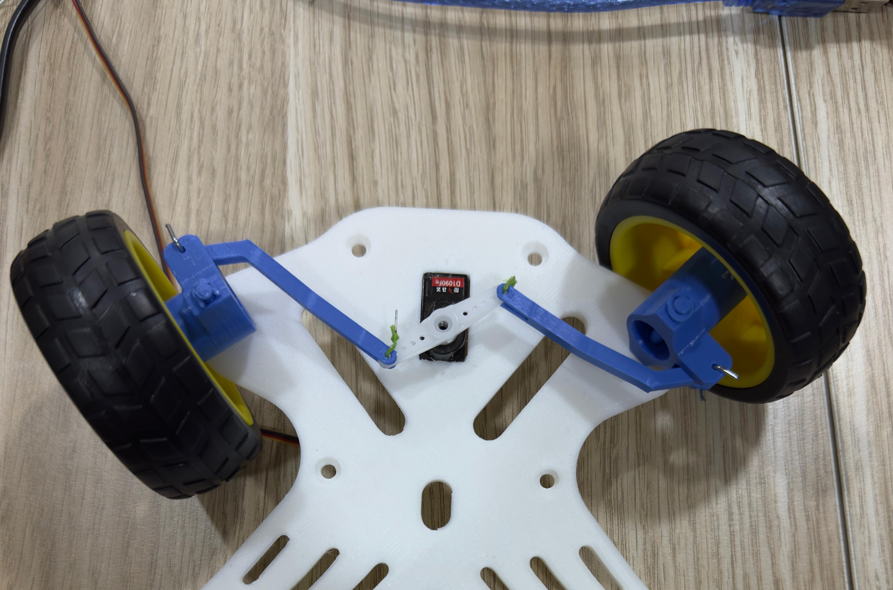 | 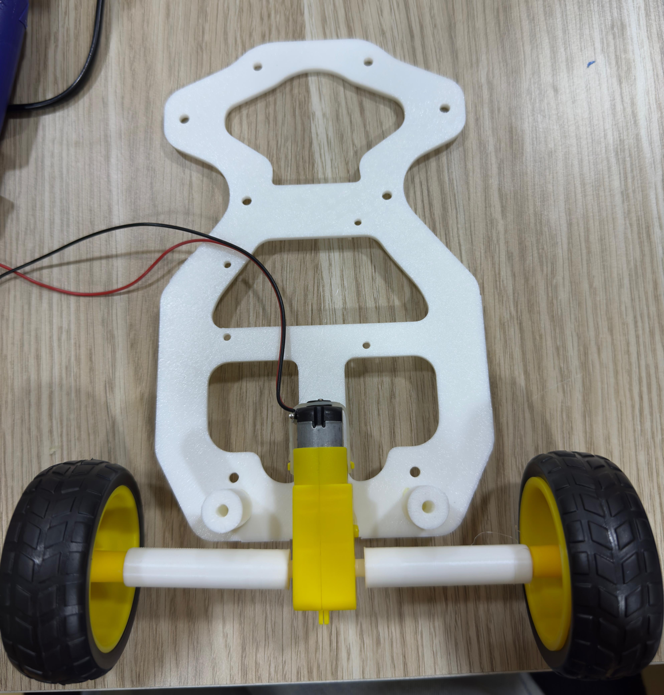 | 
| :--: | :--: | 
| *Up wheels* | *Down wheels* |

### Power Management

The vehicle is powered by two 3.7V Li-ion batteries connected in series to provide approximately 7.4V, housed in dedicated battery holders. Power is distributed through an XL4015 DC-DC 5A converter providing 5V to the Raspberry Pi and sensors. A battery management system (BMS) is included to prevent over-discharge, ensuring reliability during competition runs. The system is optimized for up to 20 minutes of continuous operation, sufficient for both open and game challenges.

### Sensing

The vehicle employs multiple sensors for navigation and obstacle detection:

- **HC-SR04 Ultrasonic Sensors (x3)**: Used for front, left, and right obstacle detection up to 2 meters, enabling precise distance measurement for navigation.
- **TCS3200 Color Sensors (x1)**: Provide color detection for identifying track markers and obstacles (red and green cubes).
- **Raspberry Pi Camera Module V1.3**: Enables line-following and visual obstacle recognition with real-time image processing.

These sensors are integrated with a Raspberry Pi 4, processing data in real-time. We selected these sensors for their cost-effectiveness and compatibility with our microcontroller. Calibration was a challenge, addressed by filtering noise in sensor data using a moving average filter.

### Obstacle Management

Our obstacle management strategy combines sensor data and algorithms to navigate challenges. When an obstacle is detected, the vehicle pauses, scans surroundings with ultrasonic sensors, and calculates an alternative path using a rule-based algorithm. The software prioritizes avoiding collisions while minimizing deviation from the intended path. For dynamic obstacles (e.g., red and green cubes), we implemented real-time updates to the path planner, using color sensor data to determine whether to pass left (green) or right (red).

This approach was chosen because rule-based navigation ensures reliable performance in the structured WRO environment. We overcame issues like false positives from sensor noise by averaging multiple sensor readings.

### 3D-Printed Components

The vehicle's steering components were constructed using 3D-printed parts, designed to ensure durability, lightweight construction, and precise integration with our electromechanical systems. We utilized a set of 3D models from [Thingiverse](https://www.thingiverse.com/thing:4772279), which provided a robust foundation for our autonomous vehicle. Key 3D-printed components include:

| 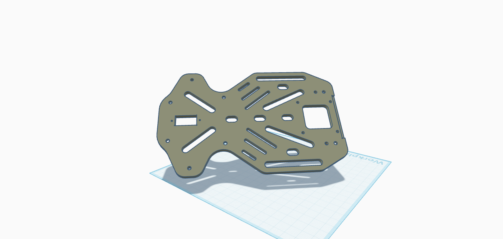 | 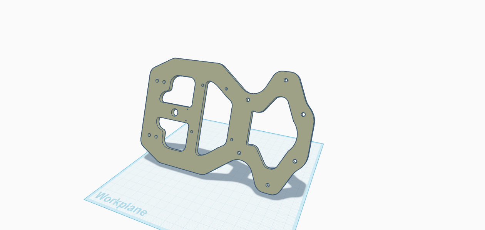 | 
| :--: | :--: | 
| *Up chassis* | *Down chassis* |
| 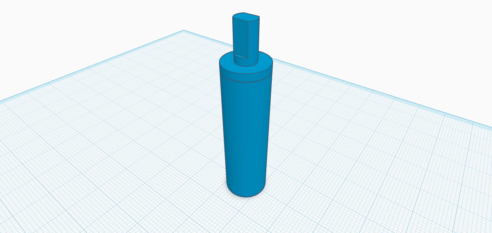 | 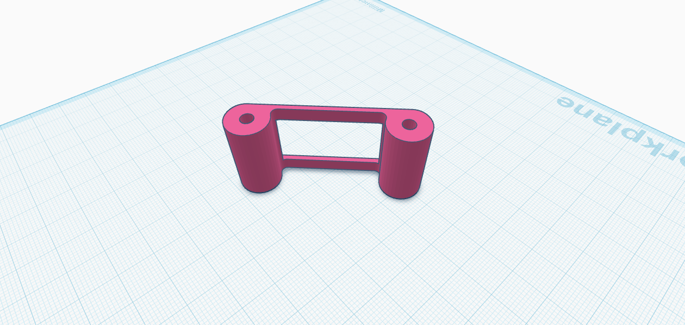 | 
| *Altered hub* | *Frontal* |
| 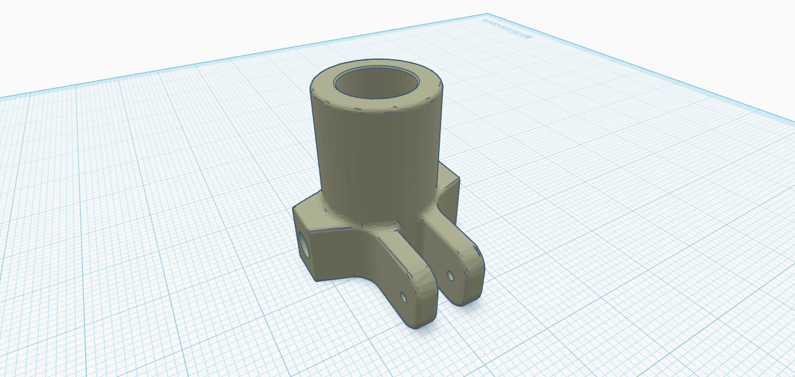 | 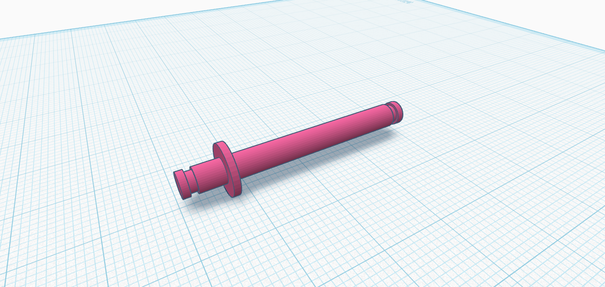 | 
| *Hub front* | *Pivot hub* |
| 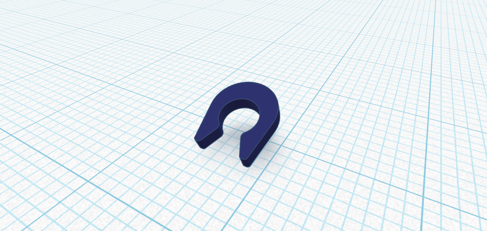 | 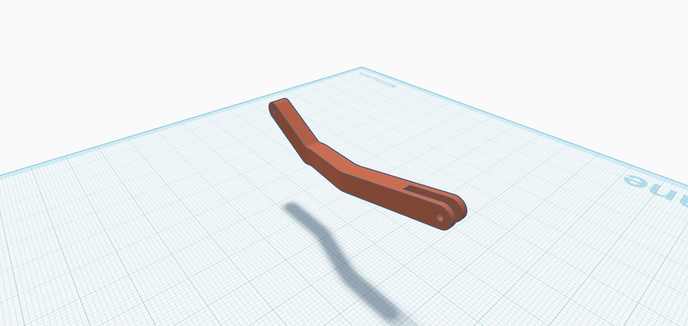 | 
| *Seeger* | *Steering bar* |


## Electromechanical Schematics

Detailed schematics is added to the schemes/ directory:

- **`wiring-diagram.png`**: shows connections between the Raspberry Pi 4, TB6612FNG motor driver, HC-SR04 ultrasonic sensors, TCS3200 color sensor, Raspberry Pi Camera, D1090Fe mini servo, and battery system.

These diagrams clarify how hardware components are wired and mounted, ensuring reproducibility.

## Component Photos

Below are images of the components used in our vehicle.

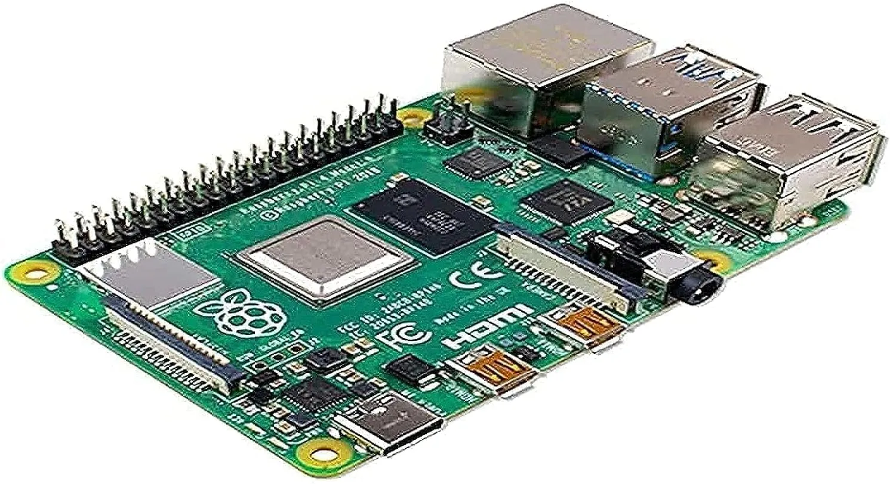

**Raspberry Pi 4 Model 4Gb**

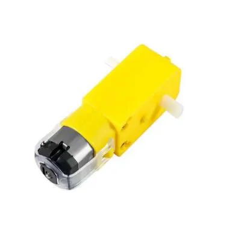

**Motor and Wheel Set (6V, 150 RPM)**

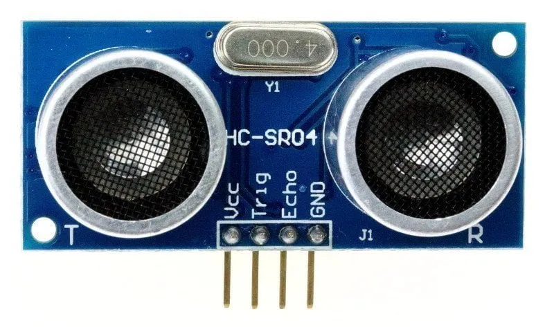

**HC-SR04 Ultrasonic Sensor**

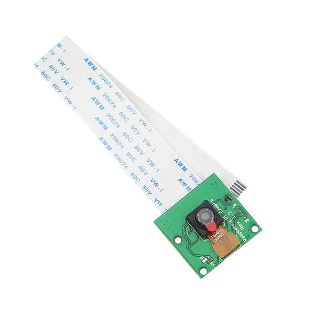

**Raspberry pi camera module**

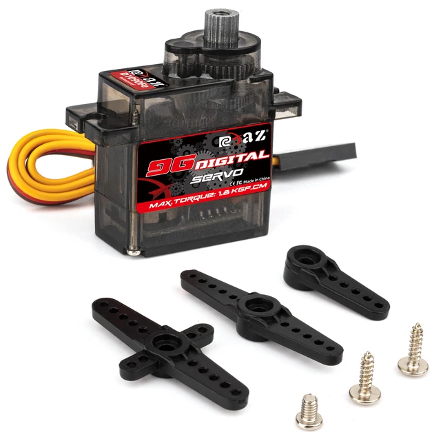

**Servo motor**

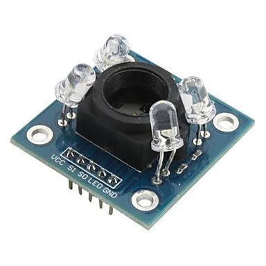

**TCS3200 Color Sensor**

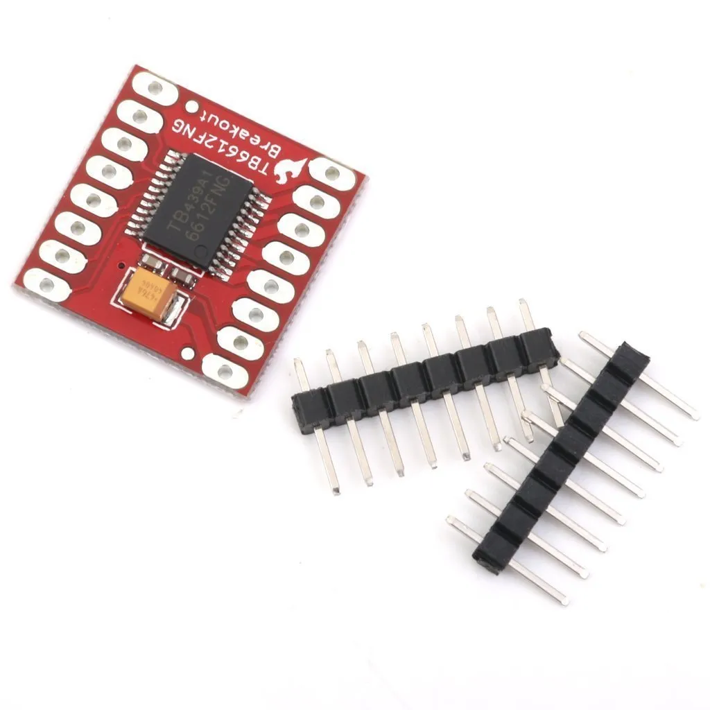

**TB6612FNG Motor Driver**

## Code Structure and Integration

The source code will be located in the **`src/`** directory, written in Python for the Raspberry Pi 4. Below is an overview of the planned code modules and their relation to hardware.

### Code Modules

>**`sensor_processing.py`**: 

This Python code controls a vehicle using three HC-SR04 ultrasonic sensors (front, left, right) and a servo motor for steering, interfaced with a Raspberry Pi via the gpiozero library. It initializes sensors on GPIO pins (front: 5/26, left: 12/13, right: 19/16) and a servo on pin 18, setting it to 90° (straight) initially. The get_distance() function measures distance in cm from each sensor, returning 999 on error. In an infinite loop, it reads distances, prints them (labeled "On" for front, "Sol" for left, "Sag" for right), and adjusts the servo: if an obstacle is closer than 10 cm in front and the right is clear (>15 cm), it turns left (180°); if the front is blocked and the left is clear (>15 cm), it turns right (0°); otherwise, it goes straight (90°). The loop pauses for 0.5 seconds per cycle.

```python
from gpiozero import DistanceSensor
from gpiozero.pins.pigpio import PiGPIOFactory
from gpiozero import AngularServo
import time

factory = PiGPIOFactory()

TRIG_FRONT = 5
ECHO_FRONT = 26
TRIG_LEFT = 12
ECHO_LEFT = 13
TRIG_RIGHT = 19
ECHO_RIGHT = 16
SERVO_PIN = 18

front_sensor = DistanceSensor(echo=ECHO_FRONT, trigger=TRIG_FRONT, pin_factory=factory, max_distance=2.0)
left_sensor = DistanceSensor(echo=ECHO_LEFT, trigger=TRIG_LEFT, pin_factory=factory, max_distance=2.0)
right_sensor = DistanceSensor(echo=ECHO_RIGHT, trigger=TRIG_RIGHT, pin_factory=factory, max_distance=2.0)
servo = AngularServo(SERVO_PIN, min_angle=0, max_angle=180, min_pulse_width=0.0005, max_pulse_width=0.0025, pin_factory=factory)

servo.angle = 90

def get_distance(sensor):
    try:
        return sensor.distance * 100
    except:
        return 999 

try:
    while True:
        dist_front = get_distance(front_sensor)
        dist_left = get_distance(left_sensor)
        dist_right = get_distance(right_sensor)
        
        print(f"On: {dist_front:.2f} cm, Sol: {dist_left:.2f} cm, Sag: {dist_right:.2f} cm")
        
        if dist_front < 10 and dist_right > 15:
            servo.angle = 180
            print('turning 180')
        elif dist_front < 10 and dist_left > 15:
            servo.angle = 0
            print('turning 0')
        else:
            servo.angle = 90
            print('turning 90')
        
        time.sleep(0.5)

except KeyboardInterrupt:
    print("Proqram dayandirildi")

finally:
    front_sensor.close()
    left_sensor.close()
    right_sensor.close()
    servo.close()
```
>**`color_sensor.py`**

This module is a standalone test script for the TCS3200 color sensor, designed to verify its ability to detect blue lines for navigation. It uses the gpiozero library with PiGPIOFactory for precise timing and connects to the sensor via GPIO pins 17 (S0), 27 (S1), 22 (S2), 23 (S3), 24 (OUT), and 25 (LED). The read_period() function measures the output signal period for red, green, and blue filters by setting S2 and S3 pins. The get_color() function averages three readings per color to reduce noise, returning periods for red, green, and blue. The periods_to_rgb() function converts these periods to normalized RGB values (0-255), and is_target_blue() checks if the detected color matches a blue line’s profile (high blue, low red/green). The main loop runs until 12 blue line detections, logging raw periods, converted periods (in microseconds), and RGB values, with feedback on blue line detection. Error handling with KeyboardInterrupt ensures clean shutdown, closing all GPIO pins to prevent hardware issues. This script is useful for testing and calibrating the color sensor independently of other modules.
```python
# -*- coding: utf-8 -*-
from gpiozero import DigitalOutputDevice, DigitalInputDevice
from gpiozero.pins.pigpio import PiGPIOFactory
import time
import statistics

factory = PiGPIOFactory()

S0 = DigitalOutputDevice(17, pin_factory=factory)
S1 = DigitalOutputDevice(27, pin_factory=factory)
S2 = DigitalOutputDevice(22, pin_factory=factory)
S3 = DigitalOutputDevice(23, pin_factory=factory)
OUT = DigitalInputDevice(24, pin_factory=factory)
LED = DigitalOutputDevice(25, pin_factory=factory)

LED.on()

S0.off()
S1.on()

def read_period(s2_val, s3_val):
    S2.value = s2_val
    S3.value = s3_val
    while OUT.value == 1:
        pass
    start = time.time()
    while OUT.value == 0:
        pass
    end = time.time()
    return end - start

def get_color(averages=3):
    red_periods = []
    green_periods = []
    blue_periods = []
    
    for _ in range(averages):
        red_periods.append(read_period(0, 0))
        green_periods.append(read_period(1, 1))
        blue_periods.append(read_period(0, 1))
    
    red = statistics.mean(red_periods)
    green = statistics.mean(green_periods)
    blue = statistics.mean(blue_periods)
    
    return red, green, blue

def periods_to_rgb(red_p, green_p, blue_p):
    if red_p == 0 or green_p == 0 or blue_p == 0:
        return 0, 0, 0
    
    i_red = 1 / red_p
    i_green = 1 / green_p
    i_blue = 1 / blue_p
    
    max_i = max(i_red, i_green, i_blue)
    if max_i == 0:
        return 0, 0, 0
    
    r = int(255 * (i_red / max_i))
    g = int(255 * (i_green / max_i))
    b = int(255 * (i_blue / max_i))
    
    return r, g, b

def is_target_blue(r, g, b):
    return b >= 40 and b <= 255 and r >= 0 and r <= 160 and g >= 0 and g <= b and b > r and b > g

try:
    print("Reng sensoru testi baslayir. Mavi xette yaxinlasdirin (2 sm mesafede).")
    blue_count = 0
    on_blue = False
    while blue_count < 12:
        periods = get_color(averages=3)
        r_period, g_period, b_period = periods
        print(f"Raw periods: R: {r_period}, G: {g_period}, B: {b_period}")
        print(f"Periods (s): R: {r_period*1e6:.2f}, G: {g_period*1e6:.2f}, B: {b_period*1e6:.2f}")
        
        r, g, b = periods_to_rgb(r_period, g_period, b_period)
        print(f"RGB: R={r}, G={g}, B={b}")
        
        if is_target_blue(r, g, b):
            if not on_blue:
                blue_count += 1
                on_blue = True
                print(f"Mavi xett askarlandi! Say: {blue_count}")
            else:
                print("Mavi xett davam edir")
        else:
            on_blue = False
            print("Mavi xett askarlanmadi. (Ferqli seth ve ya isiq seraity?)")
        
        time.sleep(0.1)
    
    print("Proqram bitdi")
    time.sleep(2.5)
    LED.off()
    S0.close()
    S1.close()
    S2.close()
    S3.close()
    OUT.close()
    LED.close()

except KeyboardInterrupt:
    print("Proqram dayandirildi")
    LED.off()
    S0.close()
    S1.close()
    S2.close()
    S3.close()
    OUT.close()
    LED.close()

```
> **`pathfinding.py`**: 

This module implements navigation logic using the Raspberry Pi camera to detect red or green areas and adjust the D1090Fe mini servo for steering. The set_servo_angle() function uses direct GPIO PWM control to set the servo angle (0° to 180°) with a 50Hz signal, mapping angles to duty cycles. The camera captures 640x480 frames, which are converted to HSV color space for robust color detection. Two red ranges and one green range are defined to create masks, and the cv2.countNonZero() function calculates the area of detected colors. If the red area exceeds 5000 pixels and is larger than the green area, the servo moves to 0°; if green dominates, it moves to 90°; otherwise, it defaults to 180°. The loop runs every 0.1 seconds, with error handling for clean shutdown and resource cleanup. This module enables vision-based navigation for the robot.
```python
import cv2
import numpy as np
import RPi.GPIO as GPIO
import time
from picamera2 import Picamera2

SERVO_PIN = 18
GPIO.setmode(GPIO.BCM)
GPIO.setup(SERVO_PIN, GPIO.OUT)
servo_pwm = GPIO.PWM(SERVO_PIN, 50)
servo_pwm.start(0)

def set_servo_angle(angle):
    if angle < 0:
        angle = 0
    elif angle > 180:
        angle = 180
    duty = angle / 18 + 2
    servo_pwm.ChangeDutyCycle(duty)
    time.sleep(0.5)
    servo_pwm.ChangeDutyCycle(0)

picam2 = Picamera2()
picam2.configure(picam2.create_preview_configuration(main={"size": (640, 480)}))
picam2.start()
time.sleep(2)

lower_red1 = np.array([0, 100, 100])
upper_red1 = np.array([10, 255, 255])
lower_red2 = np.array([170, 100, 100])
upper_red2 = np.array([180, 255, 255])

lower_green = np.array([40, 100, 100])
upper_green = np.array([80, 255, 255])

MIN_AREA = 5000

try:
    while True:
        frame = picam2.capture_array()
        hsv = cv2.cvtColor(frame, cv2.COLOR_RGB2HSV)
        
        mask_red1 = cv2.inRange(hsv, lower_red1, upper_red1)
        mask_red2 = cv2.inRange(hsv, lower_red2, upper_red2)
        mask_red = cv2.bitwise_or(mask_red1, mask_red2)
        mask_green = cv2.inRange(hsv, lower_green, upper_green)
        
        red_area = cv2.countNonZero(mask_red)
        green_area = cv2.countNonZero(mask_green)
        
        if red_area > MIN_AREA and red_area > green_area:
            print("Red detected! Moving servo to 0 degrees.")
            set_servo_angle(0)
        elif green_area > MIN_AREA and green_area > red_area:
            print("Green detected! Moving servo to 90 degrees.")
            set_servo_angle(90)
        else:
            print("No significant color detected. Moving servo to 180 degrees.")
            set_servo_angle(180)
        
        time.sleep(0.1)

except KeyboardInterrupt:
    print("Stopping...")
finally:
    servo_pwm.stop()
    GPIO.cleanup()
    picam2.stop()

```

### Relation to Hardware

- **`sensor_processing.py`** sensor_processing.py: Interfaces with the HC-SR04 ultrasonic sensor using GPIO pins 5 (TRIG) and 6 (ECHO) for distance measurements to detect obstacles.
- **`color_sensor.py`** Specifically tests the TCS3200 color sensor using GPIO pins 17 (S0), 27 (S1), 22 (S2), 23 (S3), 24 (OUT), and 25 (LED) to detect blue lines, providing standalone functionality to verify color sensor operation.
- **`pathfinding.py`**  Uses data from the color sensor (via sensor_processing.py or color_sensor_test.py) and camera to make navigation decisions, adjusting the MG90 servo (via GPIO pin 18) for steering based on detected colors (e.g., red or green areas). It indirectly influences motor control for navigation tasks like line following or obstacle avoidance.

## Photos and Videos

- **Vehicle Photos**: See **`v-photos/`** for images from all angles:
  - vehicle-front.jpg, vehicle-back.jpg, vehicle-left.jpg, vehicle-right.jpg, vehicle-top.jpg, vehicle-bottom.jpg.
- **Team Photos**: See **`t-photos/`** for **team-official.jpg** and **team-fun.jpg**.
- **Videos**: Links to YouTube demonstrations (minimum 30 seconds of autonomous driving per challenge) are in **`video/video.md`**.

## Additional Resources

- **`models/`** contains STL files for 3D-printed chassis parts.

We encourage other teams to explore this repository for inspiration, as per the WRO’s open-sharing ethos.
